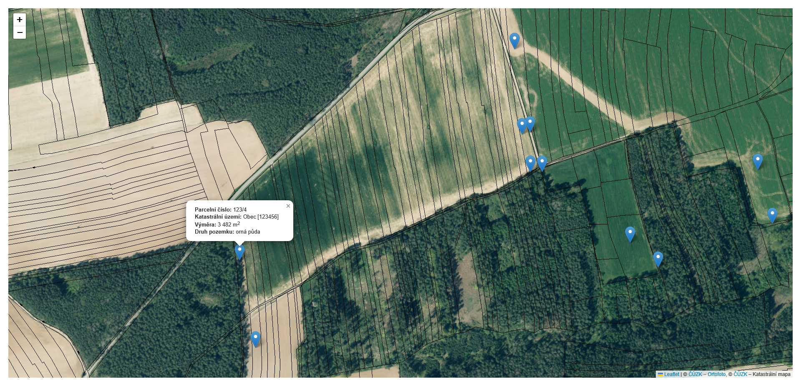

# cuzk-parcel-numbers-map

This is a very basic PHP app that shows parcels on a map by their number.

## How to install

1. Run `composer install`
2. Get an ApiKey from  https://registrace.cuzk.gov.cz -> API dat katastru nemovitostí
3. Create `config/config.php` and set `API_KEY` in it. See [config/config.php.dist](config/config.php.dist) for an example.
4. Provide input file. Input data are loaded from `config/parcel_numbers.json`. See [config/parcel_numbers.json](config/parcel_numbers.json.dist) for an example. Index at level 0 is cadastral area and children are parcel numbers.
5. Go to `src/index.php` in your browser.

Found coordinates (via ČÚZK API) are cached into `config/parcel_coordinates.json`

