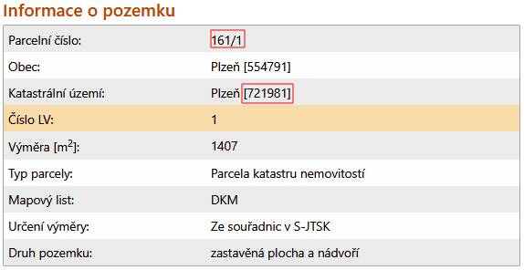

# cuzk-parcel-numbers-map

# CZ

Jedná se o základní PHP aplikaci, která zobrazuje parcely na mapě podle jejich čísla. Využívá data z **ČÚZK (Český úřad zeměměřický a katastrální)**. Je určena především jako ukázka toho, jak získat data z ČÚZK.
Vše, co potřebujete, je číslo katastrálního území a číslo parcely. Například "721981" – "161/1".

## Jak nainstalovat

1. Spusťte `composer install`
2. Získejte ApiKey z  https://registrace.cuzk.gov.cz -> API dat katastru nemovitostí
3. Vytvořte `config/config.php` a nastavte v něm `API_KEY`. Příklad najdete v [config/config.php.dist](config/config.php.dist).
4. Vytvřte vstupní soubor. Vstupní data se načítají z `config/parcel_numbers.json`. Příklad najdete v [config/parcel_numbers.json](config/parcel_numbers.json.dist). Index na úrovni 0 je katastrální území a podřízené položky jsou čísla parcel.
5. V prohlížeči otevřete `src/index.php`.

Nalezené souřadnice (získané z API ČÚZK) se ukládají do cache v `config/parcel_coordinates.json`.

---

# EN

This is a basic PHP application that displays parcels on a map by their number. It uses data from **ČÚZK (Český úřad zeměměřický a katastrální)**. It's mainly meant to show an example of how to get data from ČÚZK.
All you need is a cadastral area number and a parcel number. For example, "721981" - "161/1".

## How to install

1. Run `composer install`
2. Get an ApiKey from  https://registrace.cuzk.gov.cz -> API dat katastru nemovitostí
3. Create `config/config.php` and set `API_KEY` in it. See [config/config.php.dist](config/config.php.dist) for an example.
4. Create an input file. Input data are loaded from `config/parcel_numbers.json`. See [config/parcel_numbers.json](config/parcel_numbers.json.dist) for an example. Index at level 0 is cadastral area and children are parcel numbers.
5. Go to `src/index.php` in your browser.

Found coordinates (obtained from the ČÚZK API) are cached into `config/parcel_coordinates.json`

---

# Screenshots

